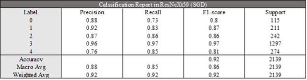

# Kaggle Competition: Cassava Leaf Disease Classification

## DateSet

21,367 labeled images collected during regular surveys in Uganda provided by Kaggle.

## Key Features:

1. Balanced sampling：

   In the case where there are significantly more label 3 than other labels, balanced sampling is performed to improve the recognition accuracy 
   of a few classes and to prevent model overfitting.
   
2. Image pre-processing Methods:
   
   - Geometric transformation: RandomVerticalFlip implements a random vertical flip of a given image with a given probability.
    
   - Image Enhancement: GaussianBlur implements blurring the image using a randomly selected gaussian blur.
    
   - Affine transform: Affine transform is a 2-dimensional linear transform consisting of 5 basic operations, namely, rotation, translation, 
    scaling, misalignment, and flip.

3. Learning Rate Adjustment Strategy MultiStepLR: The learning rate decreases in gamma proportion, which improves the convergence of the model.
   
4. 10-Fold Cross Validation：Changing the test set after each training ensures that each data point can be used as part of the test set in different rounds, enhancing the robustness and accuracy of the model.

5. Gradient descent optimisation option:
   
   - SGD (Stochastic Gradient Descent): Reduces computational overhead on large datasets by updating parameters using a random subset of the dataset.

   - AdamW (Adaptive Moment Estimation with Weight Decay): Improves RMSProp and Adam by addressing the effect of weight decay on the gradient mean in L2 regularisation, thus improving the optimisation.

## Result

   Accuracy was 92% with the ResNeXt50 with SGD model.
   
   

   
